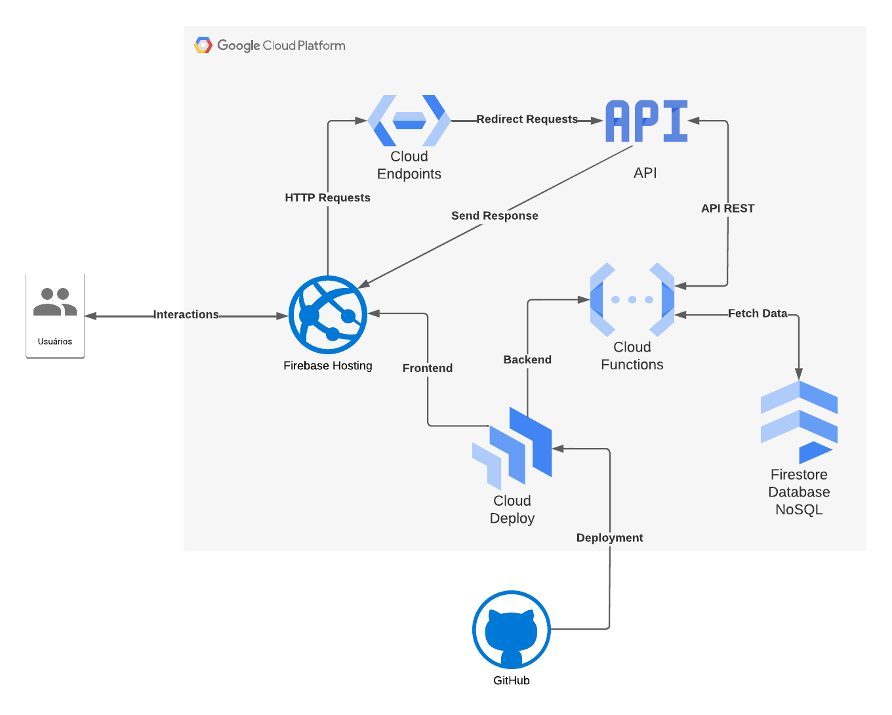

# UKnow

UKnow é uma plataforma de E-Learning 

## Sumário

1. [Branches](#branches)
2. [Levantamento de Requisitos](#levantamento-de-requisitos)
    1. [Requisitos Funcionais](#requisitos-funcionais)
    2. [Requisitos Não-Funcionais](#requisitos-não-funcionais)
3. [Arquitetura do Projeto](#arquitetura-do-projeto)

## Branches

A estrutura de branches do projeto está organizada da seguinte forma:

- [master](https://github.com/rithienatan/uknow/tree/master): Descrições e documentações do projeto.
- [frontend-indev](https://github.com/rithienatan/uknow/tree/frontend-indev): Repositório para o projeto webapp em React que está em desenvolvimento.
- [frontend-deployed](https://github.com/rithienatan/uknow/tree/frontend-deployed): Web app estático em produção.
- [backend-api-indev](https://github.com/rithienatan/uknow/tree/backend-api-indev): Repositório para o projeto Web API em Express que está em desenvolvimento.
- [backend-api-deployed](https://github.com/rithienatan/uknow/tree/backend-api-deployed): Web API em produção.

## Levantamento de Requisitos

### Requisitos Funcionais

<table>
    <tr>
        <th>ID</th>
        <th>Descrição</th>
    </tr>
    <tr>
        <td>#01</td>
        <td>Cadastro de Alunos.</td>
    </tr>
    <tr>
        <td>#02</td>
        <td>Cadastro de Professores.</td>
    </tr>
    <tr>
        <td>#03</td>
        <td>As carteiras devem ser criadas após o cadastro de Alunos e Professores.</td>
    </tr>
    <tr>
        <td>#04</td>
        <td>Professores podem criar cursos.</td>
    </tr>
    <tr>
        <td>#05</td>
        <td>Alunos e professores podem comprar cursos.</td>
    </tr>
    <tr>
        <td>#065</td>
        <td>Alunos e professores podem escolher qual o método de pagamento para a compra de cursos.</td>
    </tr>
</table>

### Requisitos Não-Funcionais

<table>
    <tr>
        <th>ID</th>
        <th>Descrição</th>
    </tr>
    <tr>
        <td>#01</td>
        <td>HTML, CSS, JavaScript</td>
    </tr>
    <tr>
        <td>#02</td>
        <td>ReactJS e React-Bootstrap</td>
    </tr>
    <tr>
        <td>#03</td>
        <td>NodeJS e ExpressJS</td>
    </tr>
    <tr>
        <td>#04</td>
        <td>Firebase - Hosting, Functions e Firestore Database (NoSQL)</td>
    </tr>
</table>

## Arquitetura do Projeto

